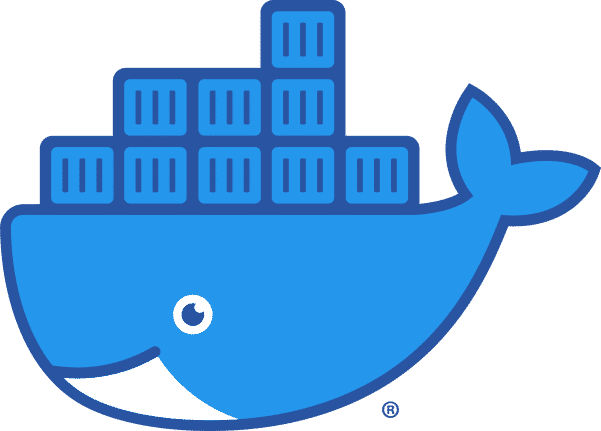

# Dockerfiles 

[](https://github.com/frost19k/Dockerfiles/blob/master/LICENSE.rst)
[](https://github.com/frost19k/Dockerfiles/actions/workflows/build-on-schedule.yml)

[//]: # (HowTo Comments: https://stackoverflow.com/a/20885980)
[//]: # (HowTo Contents: https://stackoverflow.com/a/33433098)
# Table of Contents:
1. [Before you begin](#setup)
    - [Rootless Mode](#setup-rootless)
    - [Linux Namespaces](#setup-namespaces)
2. [About this repo](#rationale)
3. [Available Images](#images)
    - [DNSValidator](#images-dnsvalidator)
    - [DVGA](#images-dvga)
    - [Grond](#images-grond)
    - [NSBrute](#images-nsbrute)
    - [WebGoat](#images-webgoat)
    - [amass](#images-amass)
    - [puredns](#images-puredns)

## Before you begin <a name="setup"></a>
By default the Docker daemon and containers run as `root`.

Aside from the security implications, this will result in any output file - generated by the container - being owned by `root` on the host machine. To avoid this, consider configuring *Docker Rootless* **OR** *Linux Namespaces*.
### Rootless mode <a name="setup-rootless"></a>
- [Run the Docker daemon as a non-root user](https://docs.docker.com/engine/security/rootless)
### Linux Namespaces <a name="setup-namespaces"></a>
- [Isolate containers with a user namespace](https://docs.docker.com/engine/security/userns-remap)
- [Use Linux user namespaces to fix permissions in docker volumes](https://www.jujens.eu/posts/en/2017/Jul/02/docker-userns-remap)

## About this repo <a name="rationale"></a>
I maintain images for tools that either don't have an official docker image or the official docker image doesn't work... or they're my own projects 😋

In this repo each [named branch](#images) contains the build files for that image.

- To download the build files run:

```Bash
❯ git clone --depth 1 --branch BRANCH https://github.com/frost19k/Dockerfiles.git
```

- Then build the image with:

```Bash
❯ docker buildx build -t BRANCH ./BRANCH
```

## Available Images <a name="images"></a>

| Branch Name   | Docker Image           |
| :--           | :--                    |
| DNSValidator  | frost19k/dnsvalidator  |
| DVGA          | frost19k/dvga          |
| Grond         | frost19k/grond         |
| NSBrute       | frost19k/nsbrute       |
| WebGoat       | frost19k/webgoat       |
| amass         | frost19k/amass         |
| puredns       | frost19k/puredns       |

[//]: # (:Format:)
[//]: # (###BRANCH <a name="images-branch"></a>)
[//]: # (- Upstream repository:)
[//]: # (- Upstream forked from:)
[//]: # (- Use this image if you get the following error in the official image)
[//]: # (- To run the container)

### DNSValidator <a name="images-dnsvalidator"></a>

- Upstream repository: https://github.com/frost19k/DNSValidator

- Upstream forked from: https://github.com/vortexau/dnsvalidator

- To run the container

```bash
❯ docker run -it --rm \
  -v "{PWD}":'/dnsvalidator' \
  frost19k/dnsvalidator -t 20 -o resolvers.txt
```

### DVGA <a name="images-dvga"></a> 

- Upstream repository: https://github.com/dolevf/Damn-Vulnerable-GraphQL-Application

- Use this image if you get the following error in the official image
```Bash
❯ docker run -it --rm -p 5013:5013 -e WEB_HOST=0.0.0.0 dolevf/dvga
Traceback (most recent call last):
  File "app.py", line 5, in <module>
    from flask import Flask
ModuleNotFoundError: No module named 'flask'
```

- To run the container

```bash
❯ docker run -it --rm -p 5013:5013 frost19k/dvga
```

Note: In this image `WEB_HOST` is already `0.0.0.0`

### Grond <a name="images-grond"></a>

- A docker image that contains a large number of tools commonly used in recon & bug bounty hunting.

- Consult the [ReadMe](https://github.com/frost19k/Grond/blob/master/README.md) for more information on how to use it.

### NSBrute <a name="images-nsbrute"></a>

- Upstream repository: https://github.com/shivsahni/NSBrute

- To run the container
```Bash
❯ docker run -it --rm \
  frost19k/nsbrute -d example.com -a 'your-AWS-AccessKey' -s 'your-AWS-SecretKey'
```

### WebGoat <a name="images-webgoat"></a> 

- Upstream repository: https://github.com/WebGoat/WebGoat

- Use this image if you get the following error in the official image

```bash
❯ docker run -it \
  -p 127.0.0.1:8080:8080 \
  -p 127.0.0.1:9090:9090 \
  -e TZ=Europe/Amsterdam \
  webgoat/webgoat
[...]
2022-05-07 09:57:36.554 ERROR 1 --- [main] hsqldb.db.HSQLDB809D8627A0.ENGINE: could not reopen database
```

- To run the container

```Bash
❯ docker run -it --rm \
  -p 8081:8081 \
  -p 9091:9091 \
  -e TZ=Europe/Amsterdam \
  frost19k/webgoat
```

### amass <a name="images-amass"></a> 

- Upstream repository: https://github.com/OWASP/Amass

- This image differs from the official in ways
  1. It runs `amass` as root inside the container
  2. It outputs to `/amass` instead of `/.config/amass`

- To run the container

```bash
❯ docker run -it --rm \
  -v "${PWD}":'/amass/' \
  frost19k/amass enum -d example.com
```

### puredns <a name="images-puredns"></a>

- Upstream repository: https://github.com/d3mondev/puredns

- To run the container
  - You can find usage examples [here](https://github.com/frost19k/puredns-docker#usage)
